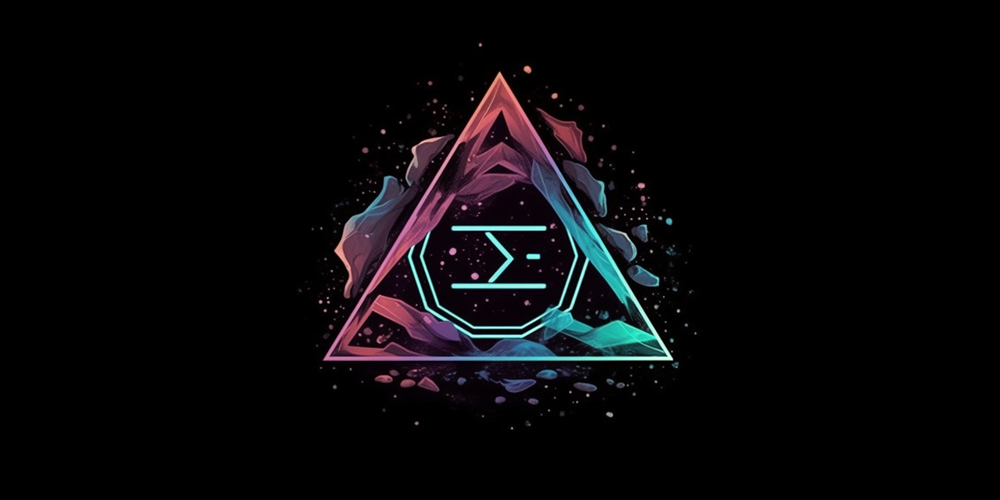
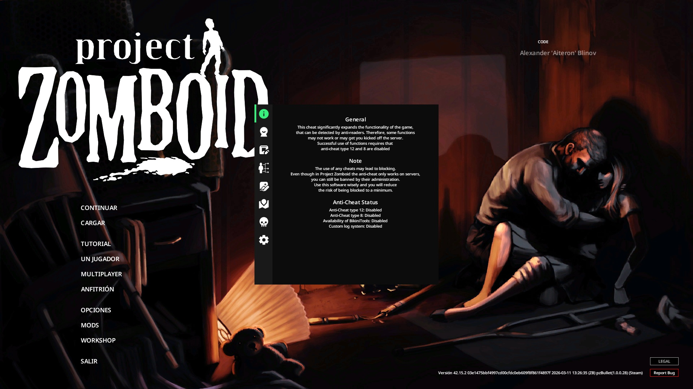
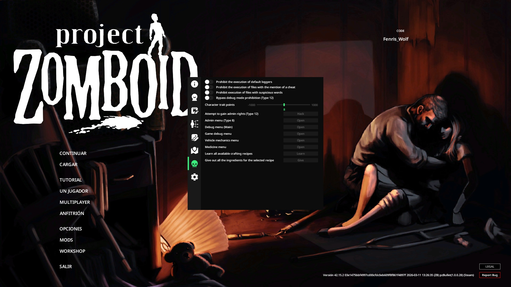
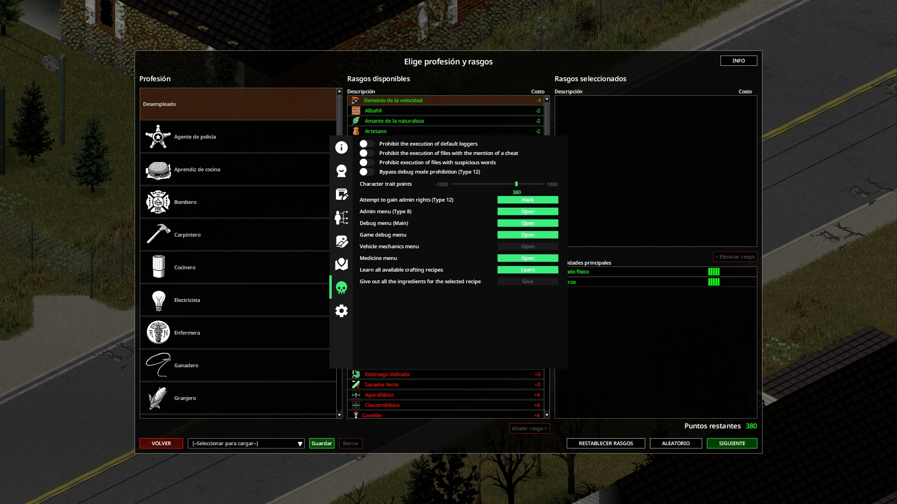
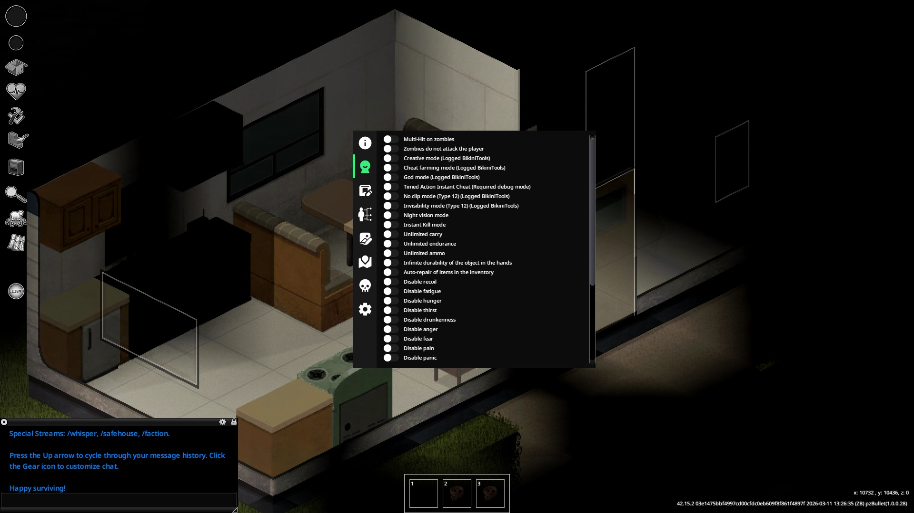
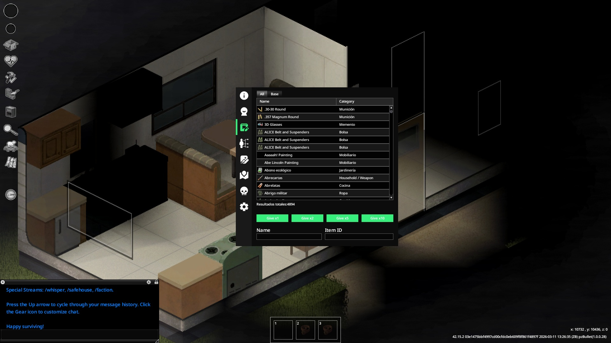
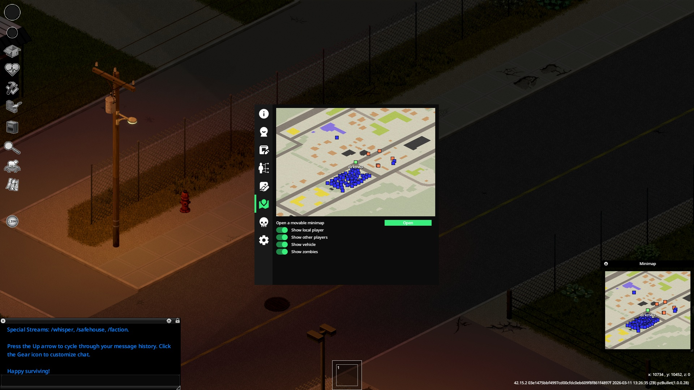
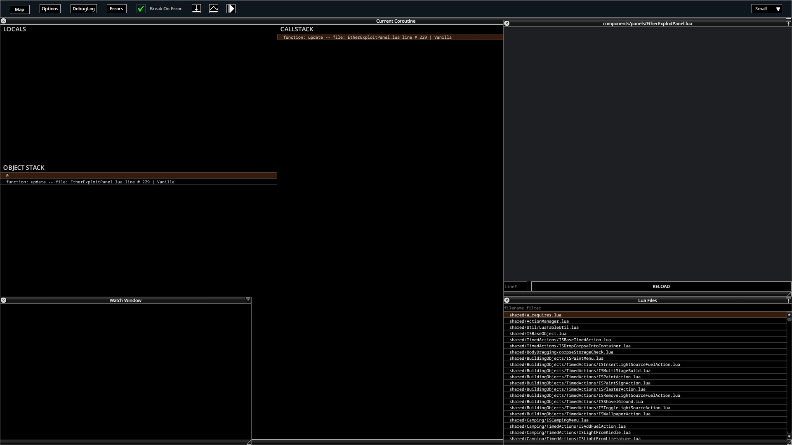
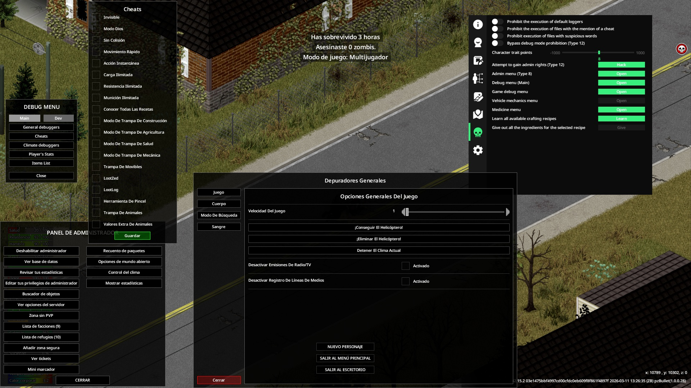
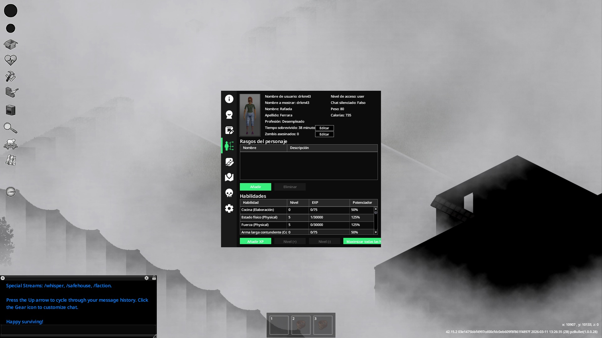

<h1 align="center">EtherMenu Lite</h1>

<p align="center">
  
  
  
  
  
</p>

**EtherMenu Lite** is a free, open-source cheat menu written in Java (API) and Lua (GUI) for **Project Zomboid Build 42** (42.15.2+).

> Fork of [EtherHack](https://github.com/Yeet-Masta/Project-Zomboid-EtherHack) by Quzile and Yeet-Masta, ported and maintained by **DRKM43**.

A **Full Edition** with additional tabs (Item Creator, Exploit & Bypass) is available via our Discord.

## Community

- **Discord:** [discord.gg/3NUKPZKZdy](https://discord.gg/3NUKPZKZdy)
- **Patreon:** [patreon.com/EtherMenu](https://www.patreon.com/EtherMenu)

## Table of Contents
- [Features](#features)
- [Screenshots](#screenshots)
- [Requirements](#requirements)
- [Building from Source](#building-from-source)
- [Installation](#installation)
- [Uninstallation](#uninstallation)
- [Usage](#usage)
- [Disclaimer](#disclaimer)
- [License](#license)

## Features

| Feature                    | Multiplayer | Co-op | Description |
|----------------------------|:-----------:|:-----:|-------------|
| Debug Mode Bypass          |   -/+(*)    |   +   | Enables developer mode in multiplayer — right-click menus for clothing, vehicle repair, map teleport, etc. |
| MultiHit Zombie            |      +      |   +   | Enables multi-hit zombie mode |
| Invisible                  |   -/+(*)    |   +   | Become invisible to all players |
| God Mode                   |   -/+(*)    |   +   | Character immortality |
| No Clip                    |   -/+(*)    |   +   | Pass through walls and objects |
| Unlimited Carry            |      +      |   +   | Infinite carry capacity |
| Unlimited Endurance        |      +      |   +   | Unlimited endurance |
| Disable Fatigue            |      +      |   +   | No need to sleep |
| Disable Hunger             |      +      |   +   | No need to eat |
| Disable Thirst             |      +      |   +   | No need to drink |
| Disable Character Needs    |      +      |   +   | Disables all character needs, sets stats to optimal |
| Add x100 Trait Points      |   -/+(**)   |   +   | Adds +100 points in character creation |
| Game Debugger              |      +      |   +   | Opens the debug window |
| Player Editor              |      +      |   +   | Character editor for skills, traits, etc. |
| Get Admin Access           |   -/+(*)    |   +   | Obtain server admin rights |
| Open Admin Menu            |   -/+(*)    |   +   | Opens the admin panel |
| ESP / Visuals              |      +      |   +   | Player, zombie, and vehicle ESP overlays |
| Map & Teleport             |      +      |   +   | Minimap with teleport support |

(*) Works in multiplayer if certain anti-cheat types are disabled on the server.  
(**) Only works during initial character creation from the main menu.

## Screenshots










## Requirements

- **JDK 17** ([Eclipse Temurin](https://adoptium.net/temurin/releases/?version=17)) — for Gradle build
- **JDK 25** ([Oracle](https://jdk.java.net/25/) or [Temurin EA](https://adoptium.net/temurin/releases/?version=25)) — for compilation (PZ 42 uses Java 25 bytecode)
- Steam copy of [Project Zomboid](https://store.steampowered.com/app/108600/Project_Zomboid/) Build 42

## Building from Source

1. Clone the repository:
```bash
git clone https://github.com/drkm9743/EtherMenu-Lite.git
cd EtherMenu-Lite
```

2. Copy the required game libraries to the `lib/` folder:
```
lib/
├── fmod.jar        # From PZ install dir
├── Kahlua.jar      # From PZ install dir
├── org.jar         # From PZ install dir
└── zombie.jar      # From PZ install dir
```

> **Note:** These JARs are not included for copyright reasons. Extract them from your own Project Zomboid installation.

3. Build the JAR:

**Windows (PowerShell):**
```powershell
$env:JAVA_HOME = "C:\Path\To\jdk-17"
$env:PATH = "$env:JAVA_HOME\bin;$env:PATH"
.\gradlew.bat jar "-Pjdk25Home=C:\Path\To\jdk-25"
```

**Linux / macOS:**
```bash
export JAVA_HOME=/path/to/jdk-17
./gradlew jar -Pjdk25Home=/path/to/jdk-25
```

The built JAR will be at `build/EtherMenu-1.0.6-lite.jar`.

## Installation

1. Copy the built JAR to your Project Zomboid game folder.

2. Open a terminal in the game folder and run:
```bash
java -jar EtherMenu-1.0.6-lite.jar --install
```

> **Important:** Use JDK 25 (matching your PZ installation) to run the installer.

## Uninstallation

```bash
java -jar EtherMenu-1.0.6-lite.jar --uninstall
```

## Usage

After installation, launch the game normally.

- Press **`F1`** to open the cheat menu (configurable in Settings)
- Press **`Home`** to reload the Lua GUI

## A note on the full version paywall

I'm a hardcore open source believer. Genuinely. This lite version being public
is not a marketing stunt — it's my default position on software.

So why is there a paid full edition at all? Honest answer: my laptop barely
runs the game, I'm unemployed, and keeping this maintained has a real cost in
time and hardware. The paywall isn't greed, it's survival. The moment my
situation stabilizes, the full edition goes open source, no conditions, no
exceptions. I'm not building a business here.

On the longevity of this project: I play PZ multiplayer every day. I genuinely
love this game and the community around it. As long as the devs keep shipping
updates without real server-side anticheat, I'll keep updating this — it's a
cat and mouse game I enjoy playing. And before anyone says it: yes, I want the
devs to eventually implement proper anticheat. Good anticheat means a better
game for everyone. Until then, this exists.

TL;DR — temporarily freemium by necessity, permanently open source by
conviction. If you want to support development and speed up the "full open
source" timeline, Discord is linked above.

## Disclaimer

This software is provided for educational and single-player use only. Use on multiplayer servers may violate server rules and result in bans. **Use at your own risk.**

The authors are not responsible for any consequences resulting from the use of this software.

## License

MIT License — see [LICENSE.txt](LICENSE.txt)
